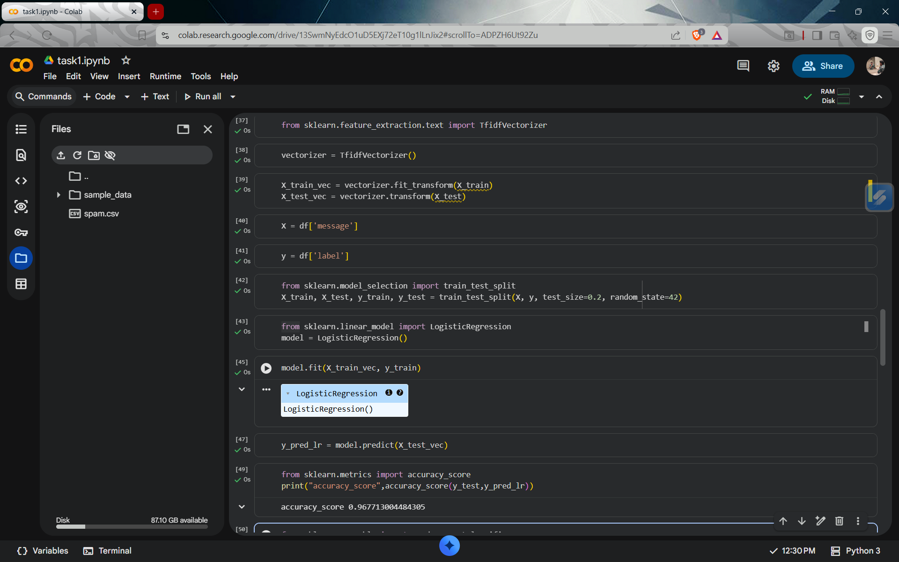
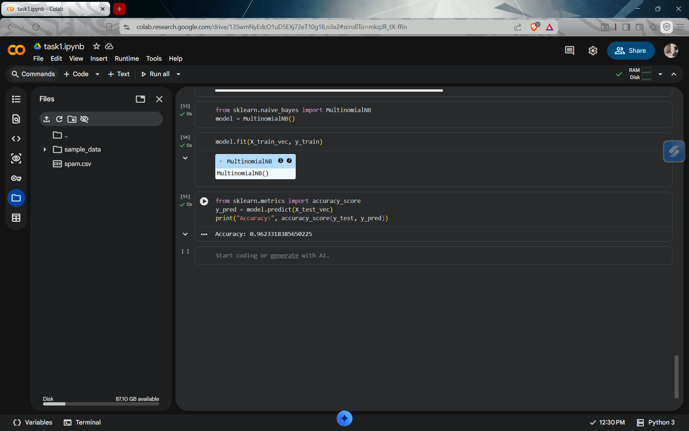
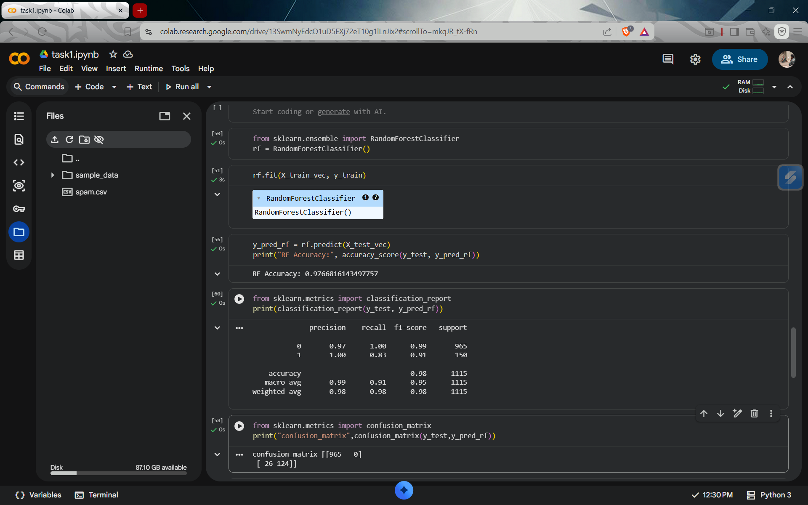

# Task 1 - Spam SMS Detection

This project is part of my Machine Learning Internship at CodSoft.

---

## Objective
To build a machine learning model that classifies SMS messages as **Spam** or **Not Spam (Ham)**.

---

## Dataset
The dataset contains SMS messages with labels:
- **ham (0)** → Not Spam  
- **spam (1)** → Spam  

---

## Steps Performed
- Data Cleaning (removed unnecessary columns)
- Label Encoding (ham → 0, spam → 1)
- Train-Test Split
- Text Vectorization using TF-IDF
- Model Training & Evaluation

---

## Models Used

### Logistic Regression

### Naive Bayes

### Random Forest (Best Model)

---

## Model Comparison

| Model | Accuracy |
|------|---------|
| Logistic Regression | 96.7% |
| Naive Bayes | 96.2% |
| Random Forest | **97.6%** |

---

## Final Model

**Random Forest** was selected as the final model because it achieved the highest accuracy and best overall performance.

---

## Key Insights
- Random Forest performed better than Logistic Regression and Naive Bayes
- The model achieved high precision, reducing false spam alerts
- TF-IDF helped convert text into meaningful numerical features

---

## Tools & Technologies
- Python
- Pandas
- Scikit-learn
- TF-IDF Vectorizer

---

## Conclusion
The project successfully classifies SMS messages with high accuracy.  
Random Forest proved to be the most effective model for this task.

---

## Author
V Naresh (Machine Learning Intern)
