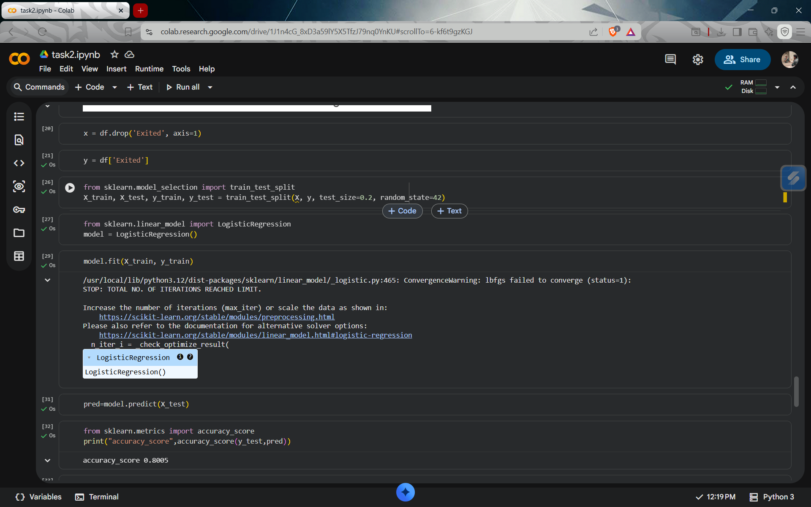
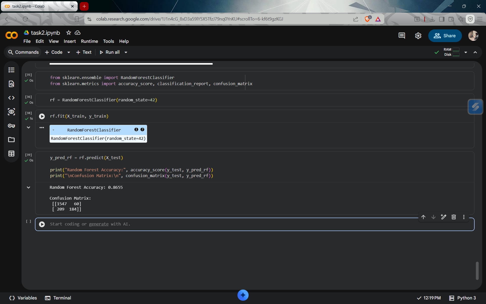
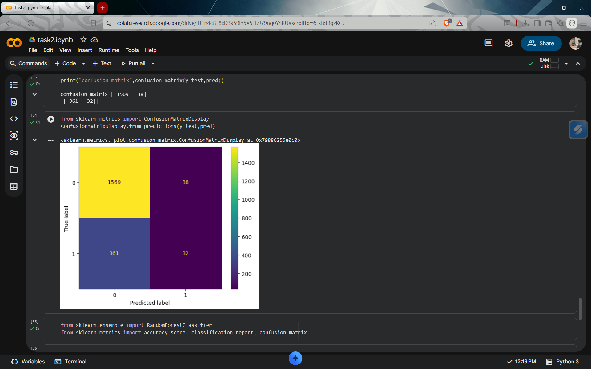

# Task 2 - Customer Churn Prediction

This project is part of my Machine Learning Internship at CodSoft.

## Objective
To build a machine learning model that predicts whether a customer will churn (leave) or not.

---

## Dataset
The dataset contains customer details such as:
- Credit Score
- Geography
- Gender
- Age
- Tenure
- Balance
- Number of Products
- Active Membership
- Estimated Salary

Target Variable:
- **Exited (1 = Churn, 0 = Not Churn)**

---

## Steps Performed
- Data Cleaning (removed unnecessary columns)
- Data Encoding (converted categorical variables)
- Exploratory Data Analysis (correlation heatmap)
- Train-Test Split
- Model Training

---

## Models Used
- Logistic Regression
- Random Forest (Best Model)

---

## Results

### Logistic Regression Accuracy

### Random Forest Accuracy

### Confusion Matrix

---

## Conclusion
Random Forest performed better with an accuracy of around **86.5%** and improved churn detection compared to Logistic Regression.

---

## Tools & Technologies
- Python
- Pandas
- NumPy
- Scikit-learn
- Matplotlib
- Seaborn

---

## Author
V Naresh (Machine Learning Intern)
