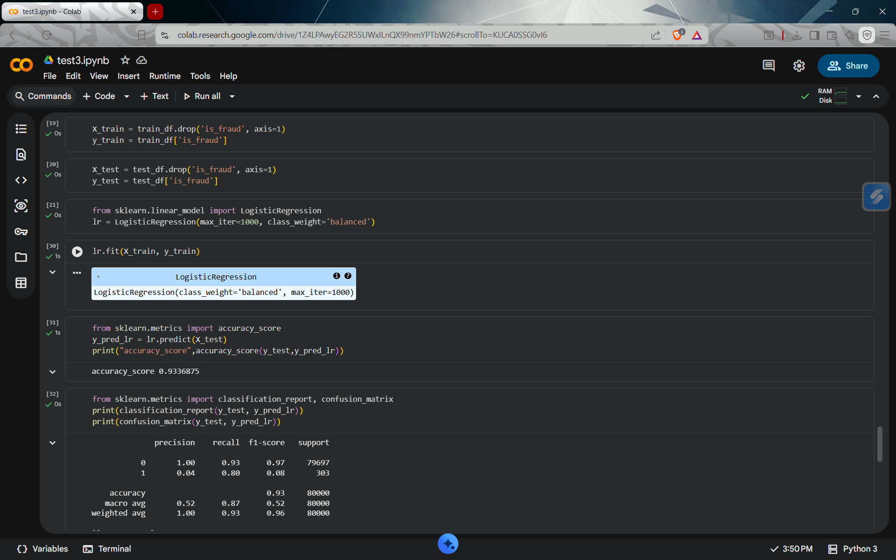
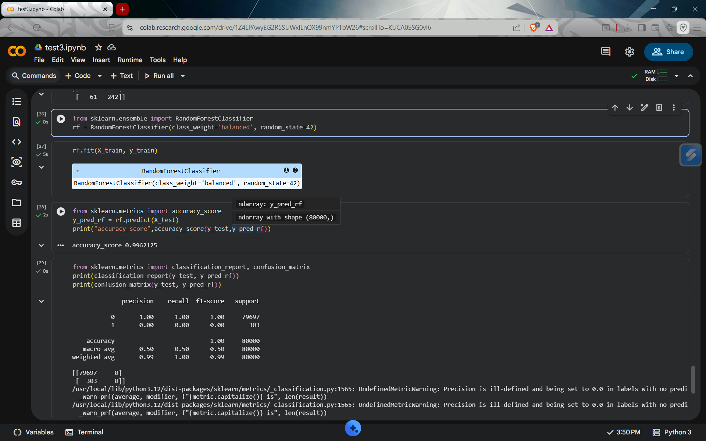

# Task 3 - Credit Card Fraud Detection

This project is part of my Machine Learning Internship at CodSoft.

---

## Objective
To build a machine learning model that detects **fraudulent credit card transactions**.

---

## Dataset
The dataset contains transaction details with a target label:
- **0 → Legitimate Transaction**
- **1 → Fraudulent Transaction**

⚠️ Note: The dataset is **highly imbalanced**, with very few fraud cases.

---

## Steps Performed
- Data Cleaning (removed unnecessary columns)
- Handling Imbalanced Data using class weights
- Feature Selection
- Train-Test Split
- Model Training & Evaluation

---

## Models Used

### Logistic Regression (Best Model)

### Random Forest

---

## Model Comparison

| Model | Accuracy | Recall (Fraud) |
|------|---------|---------------|
| Logistic Regression | 93% | **0.80** |
| Random Forest | 99% | 0.00 |

---

## Final Model

**Logistic Regression** was selected as the final model because it successfully detects fraudulent transactions, unlike Random Forest.

---

## Key Insights
- High accuracy does **not** mean better performance in imbalanced datasets
- Random Forest failed to detect fraud despite high accuracy
- Logistic Regression achieved good recall, making it more reliable
- Recall is the most important metric for fraud detection

---

## Tools & Technologies
- Python
- Pandas
- Scikit-learn

---

## Conclusion
The project highlights the importance of evaluating models using the right metrics.  
Logistic Regression proved to be more effective for fraud detection due to its ability to identify fraudulent transactions.

---

## Author
V Naresh (Machine Learning Intern)
